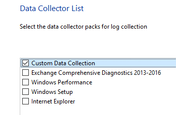

# Customer-ready email template

First, please download the Intune.xml file from [this link](https://raw.githubusercontent.com/markstan/IntuneOneDataCollector/master/Intune.xml) (right-click and choose "save as..." in IE and Chrome; Edge users should copy all text to a plain text file and save as 'Intune.xml').

Once you have the file copied, please use these steps to collect the diagnostic:

1. Make sure the device is connected to the Internet, then connect to https://aka.ms/SaRA-Assisted.  Install and run the SetupProd_Assisted.exe program when prompted. Note:  If you receive a warning that downloads are not permitted from the site, be sure to add https://outlookdiagnostics.azureedge.net to the trusted sites in your browser.

1. Click **I agree** to accept the license agreement

1. Click **Yes** when you see the **Do you want to allow this app to make changes to your device?  Windows host process (Rundll32)** prompt

1. Type your support key **XXXXXXXXX_replace_this_with_the_link_from_sdcon** in the space provided then click next

1. Follow the on-screen instructions to run the One Data Collector tool on this computer or prepare the package for use on another computer then click **Next**.  

1.  Leave the "Microsoft Support and Recovery Assistant for Office 365" running in the background.  When the **One Data Collector** window appears, click **Next**.

1. Select "Send diagnostics to Microsoft" 

1. Select "Custom Data Collection"    &nbsp;&nbsp;&nbsp; 

1. Browse to Intune.xml and click next 

1. Wait for the wizard to complete. It will take some time (2-3 minutes typically).

1.  When One Data Collector completes, click on **Close the troubleshooter** to return to the "Microsoft Support and Recovery Assistant for Office 365" window.

1. Click on the **Microsoft Support site** hyper-link in the "Microsoft Support and Recovery Assistant for Office 365" Window to upload the collected data.  The file will be located in %localappdata%\Temp\DiagnosticResult.  Each execution will produce a zip file name Diagnostic_results_`<guid`>.zip.  Follow the directions on the Secure File Exchange site to upload your results.