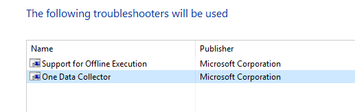
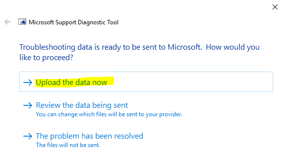

# Customer-ready email template

First, please download the Intune.xml file from [this link](https://raw.githubusercontent.com/markstan/IntuneOneDataCollector/master/Intune.xml) (right-click and choose "save as..." in IE and Chrome; Edge users should copy all text to a plain text file and save as 'Intune.xml'.).

Once you have the file copied to the workstation, please use these steps to collect the diagnostic. It should only take a few minutes to collect and upload:

1. Make sure the device is connected to the Internet, then click on Start and type **MSDT** in the search box, then select MSDT (run command) from the search results

1. Type your support key **XXXXXXXXX_replace_this_with_the_key_from_sdcon** in the space provided then click next

1. Follow the on-screen instructions to run the diagnostic package on this computer or prepare the package for use on another computer

1. Choose "One Data Collector" and click **Next**   &nbsp;&nbsp;&nbsp; 

1. Select "This computer" when prompted

1. Select "Send diagnostics to Microsoft" 

1. Select "Custom Data Collection"    &nbsp;&nbsp;&nbsp; 

1. Browse to Intune.xml and click next 

1. Wait for the wizard to complete. It will take some time (2-3 minutes typically).

1. When prompted, choose "Upload the data now". You may also choose "Review the data being sent" to see the files included in the automatic upload. Your support professional will receive an automated notice when the file is uploaded    &nbsp;&nbsp;&nbsp; 
